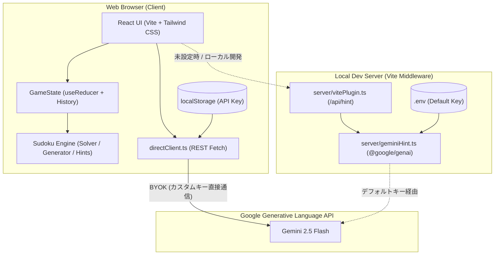
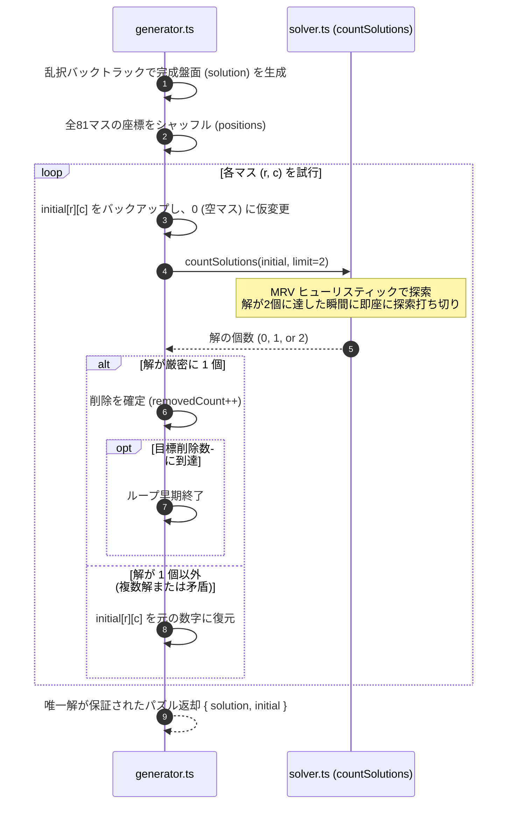
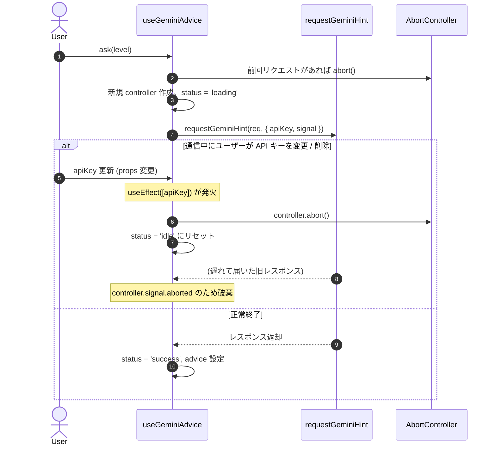

# Sudoku AI システム設計書 (System Design Specification)

## 1. システムアーキテクチャ設計

### 1.1 全体構成
本システムは、ブラウザ単体で完結する完全なフロントエンド Single Page Application (SPA) として構成され、Gemini AI との通信にはハイブリッドなデュアル通信方式を採用している。



### 1.2 通信方式設計 (デュアル・アシスタント)
1. **Direct Client 方式 (本番推奨)**:
   - ユーザーが入力した API キーを用いて、ブラウザから Google の REST エンドポイント (`https://generativelanguage.googleapis.com/v1beta/models/gemini-2.5-flash:generateContent?key=...`) へ直接リクエスト。
   - Vercel 等のサーバーレスホスティングで問題となるタイムアウト、環境変数管理、コールドスタートを完全に回避。
2. **Server Proxy 方式 (開発・フォールバック)**:
   - Vite 開発サーバーに組み込まれた `geminiHintPlugin` が `POST /api/hint` をハンドリング。
   - `@google/genai` 公式 SDK を利用し、開発時に `.env` のデフォルトキーで即座に動作検証可能。

---

## 2. ディレクトリ & モジュール構造

```text
sudoku-ai-app/
├── docs/                      # プロジェクト仕様書・設計書
│   ├── requirements.md        # 要件定義書
│   └── design.md              # システム設計書
├── server/                    # 開発用 Vite サーバープラグイン
│   ├── geminiHint.ts          # サーバー側 Gemini プロンプト生成・API通信
│   └── vitePlugin.ts          # Vite ミドルウェアハンドラ
├── src/
│   ├── components/            # UI コンポーネント群
│   │   ├── ActionTools.tsx    # Undo, 消去, メモ切替, 誤入力リセットボタン
│   │   ├── ApiKeyModal.tsx    # API キー設定モーダル (BYOK)
│   │   ├── Board.tsx          # 9x9 数独グリッド表示
│   │   ├── Cell.tsx           # 個別セル（数字・メモ表示・ハイライト）
│   │   ├── DifficultyBar.tsx  # 難易度選択バー
│   │   ├── GeminiAdvisor.tsx  # Gemini AI アドバイザー（L1〜L4）
│   │   ├── Header.tsx         # タイマー, ミスカウンタ, 設定, テーマ
│   │   ├── HintPanel.tsx      # ローカル論理ヒント・自動メモ・解答展開
│   │   ├── Numpad.tsx         # ナンパッド（残り配置可能数バッジ付き）
│   │   ├── TechniqueInfo.tsx  # 数独解法テクニック解説ガイド
│   │   └── VictoryModal.tsx   # クリア祝賀モーダル
│   ├── hooks/                 # React カスタムフック
│   │   ├── useApiKey.ts       # API キーの localStorage 同期
│   │   ├── useGeminiAdvice.ts # Gemini アドバイス要求 & Abort 管理
│   │   ├── useSudokuGame.ts   # ゲームメインループ & キーバインド
│   │   ├── useTheme.ts        # ダークモード管理
│   │   └── useTimer.ts        # ゲームタイマー計測
│   ├── lib/
│   │   ├── gemini/            # クライアント側 Gemini 通信ライブラリ
│   │   │   ├── directClient.ts# REST API 直接呼び出し & プロンプト生成
│   │   │   ├── hintClient.ts  # 通信方式の自動振り分けルーター
│   │   │   └── types.ts       # Gemini 連携関連の型定義
│   │   └── sudoku/            # 数独コアロジック
│   │       ├── board.ts       # 盤面コピー, 配置妥当性, ミスカウント
│   │       ├── gameReducer.ts # ゲーム状態遷移 (Reducer)
│   │       ├── generator.ts   # 唯一解保証パズル生成
│   │       ├── hints.ts       # 誤入力優先検知 & Naked/Hidden Single推論
│   │       ├── solver.ts      # MRV バックトラッキング解法 & 解数カウント
│   │       └── types.ts       # 数独ドメインの型定義
│   ├── App.tsx                # ルートコンポーネント
│   └── main.tsx               # アプリケーションエントリポイント
```

---

## 3. データ構造 & ドメインモデル設計

### 3.1 基本型定義 ([`src/lib/sudoku/types.ts`](file:///c:/Users/takeo.satou/Documents/GA/sudoku-ai-app/src/lib/sudoku/types.ts))

```ts
export type Grid = number[][]          // 9x9 の数値配列 (0: 空マス, 1〜9: 配置数字)
export type Notes = Set<number>[][]    // 9x9 の Set 配列 (候補数字の集合)
export type Difficulty = 'easy' | 'medium' | 'hard'

export interface Position {
  row: number // 0〜8
  col: number // 0〜8
}

// 共通ヒントインターフェース
export interface BaseHint {
  type: string
  badge: string
  row: number
  col: number
  reason: string
}

// 数字配置ヒント (正解数字を持つ)
export interface PlacementHint extends BaseHint {
  kind: 'placement'
  num: number // 正解の数字 (1〜9)
}

// 誤入力修正ヒント (正解数字を持たず、現在の誤入力数字を持つ)
export interface CorrectionHint extends BaseHint {
  kind: 'correction'
  currentNum: number // 現在誤って入力されている数字
}

// 判別可能 Union 型
export type Hint = PlacementHint | CorrectionHint
```

### 3.2 ゲーム状態管理モデル ([`src/lib/sudoku/gameReducer.ts`](file:///c:/Users/takeo.satou/Documents/GA/sudoku-ai-app/src/lib/sudoku/gameReducer.ts))

```ts
export interface GameState {
  gameId: number
  difficulty: Difficulty
  solution: Grid         // 完成盤面（正解データ）
  initial: Grid          // 初期問題盤面（編集不可手がかり）
  board: Grid            // 現在の盤面
  notes: Notes           // 現在の候補メモ
  selected: Position | null // 選択中マス
  noteMode: boolean      // メモ入力モード中か
  history: Snapshot[]    // Undo 用履歴スタック（最大 30 手）
  mistakes: number       // ミス累計カウント (最大 3)
  activeHint: Hint | null// 現在ハイライト中のヒント
  hintPanel: HintPanelState // ヒントパネルの表示状態
}

export type GameAction =
  | { type: 'NEW_GAME'; difficulty: Difficulty; solution: Grid; initial: Grid }
  | { type: 'SELECT'; pos: Position }
  | { type: 'MOVE'; dRow: number; dCol: number }
  | { type: 'INPUT'; num: number }
  | { type: 'ERASE' }
  | { type: 'UNDO' }
  | { type: 'TOGGLE_NOTE_MODE' }
  | { type: 'HINT' }
  | { type: 'AUTO_NOTES' }
  | { type: 'SOLVE_ALL' }
  | { type: 'CHECK' }
```

---

## 4. コアアルゴリズム詳細設計

### 4.1 唯一解保証パズル生成アルゴリズム (`generator.ts` & `solver.ts`)

従来の「無条件ランダム削除」から、「厳密解検証付き段階削除」へ刷新。



#### 解カウント高速化のポイント:
- **盤面不変保証**: 探索前に `cloneGrid(board)` し、呼び出し元の盤面を一切変更しない。
- **MRV (Minimum Remaining Values)**: 空きマスを探索する際、行・列・ブロックの制約から「候補数が最も少ない空きマス」を優先的に選択して枝刈りを最大化。
- **配置矛盾事前ガード**: `isBoardValid` により、初期盤面に重複がある場合は探索を行わずに即座に `0` を返却。

### 4.2 誤入力最優先検知 & 論理ヒントアルゴリズム (`hints.ts`)

```mermaid
flowchart TD
    Start([ヒント要求]) --> CheckMistake{盤面に誤入力があるか？<br/>board[r][c] !== solution[r][c]}
    
    CheckMistake -- "はい (誤入力あり)" --> ReturnCorrection["CorrectionHint を返却<br/>- kind: 'correction'<br/>- 正解数字は非表示<br/>- 誤りマス座標と消去理由を提示<br/>- トーン: rose (警告)"]
    
    CheckMistake -- "いいえ (正常)" --> CalcCandidates[computeCellCandidates<br/>ルール上の候補数字を算出]
    
    CalcCandidates --> Strategy1{Naked Single<br/>候補が1つのマス}
    Strategy1 -- "該当あり" --> RetNaked["PlacementHint (唯一候補マス)<br/>kind: 'placement', 正解数字あり"]
    
    Strategy1 -- "なし" --> Strategy2{Hidden Single (Block)<br/>ブロック内で数字が一択}
    Strategy2 -- "該当あり" --> RetHiddenB["PlacementHint (ブロック隠れ一択)"]
    
    Strategy2 -- "なし" --> Strategy3{Hidden Single (Row / Col)<br/>行または列内で数字が一択}
    Strategy3 -- "該当あり" --> RetHiddenRC["PlacementHint (行/列の隠れ一択)"]
    
    Strategy3 -- "なし" --> Fallback["PlacementHint (高難度推論)<br/>解から1手を抽出"]
```

### 4.3 Gemini AI プロンプト構造 & ヒントレベル整合設計

プロンプト構築関数 `buildPrompt` は、クライアント直接通信（`directClient.ts`）とサーバープラグイン（`geminiHint.ts`）で完全に同一のロジックを共有する。

```text
# プロンプト構成
1. システム指示 (SYSTEM_INSTRUCTION)
   - 親切な数独コーチ、温かく簡潔な日本語トーン (最大4文程度)
   - 確定情報の厳守、指定レベルを超えた回答漏洩の禁止
   - 盤面ミスがある場合は最優先で指摘
2. 現在の盤面 (81マスのテキスト表現)
3. 状況 (空きマス数、ユーザーのミス回数、誤入力マス一覧、メモ一覧)
4. 指導対象 (確定情報)
   - 誤入力あり: 【誤入力の見直し】行X、列Yの入力「W」は誤り。正解は「N」。※架空の推論は捏造せず案内。
   - 正常時: 行X、列Yに「N」（手法名、論理根拠メモ）
5. レベル別指示
```

| ヒントレベル | 通常時の指示 (LEVEL_INSTRUCTIONS_NORMAL) | 誤入力時の指示 (LEVEL_INSTRUCTIONS_MISTAKE) |
|---|---|---|
| **レベル1 (ノーヒント)** | 具体的なマスも数字も言わない。着眼点の方向のみ促す。 | 具体的なマスや数字は言わない。誤入力の存在と見直しのみ促す。 |
| **レベル2 (着眼点)** | 注目すべき範囲（ブロック/行/列）と解法パターンを伝える。 | 誤入力が存在する大まかな範囲（ブロック/行/列）のみを伝える。 |
| **レベル3 (マス特定)** | 具体的なマス（行・列）と根拠を説明。数字は伏せる。 | 誤入力が存在する具体的なマス（行・列）を特定し、見直しを促す。 |
| **レベル4 (直接回答)** | 注目マスと正解数字を明示し、論理ステップを解説。 | 誤入力マスと保存済みの正解を提示（架空の論理解説は作らない）。 |

---

## 5. 状態管理 & ライフサイクル設計

### 5.1 `useGeminiAdvice` フックのライフサイクル制御



---

## 6. テスト設計

### 6.1 テスト方針
Vitest による高速・高カバレッジな自動テストを構築。DOM 非依存で実行可能な設計とし、CI/CD やローカル環境で即座に検証可能とする。

### 6.2 主なテストスイート
1. **`sudoku.test.ts` (数独コア & アルゴリズム)**:
   - `isValidPlacement`, `isSolved`, `countMistakes`, `countRemaining`, `cleanPeerNotes` の正確性
   - `countSolutions` の盤面不変保証、解0件（矛盾・重複）、解1件（一意）、解2件（複数解上限）の正確性
   - 再現可能シード（Mulberry32 PRNG）を用いた **各難易度 100問連続生成バッチテスト**（複数解発生率 0/100 の検証、生成時間の統計計測）
   - `findSmartAIHint` の誤入力優先検知（`CorrectionHint` と `PlacementHint` の分離、全マス埋まり誤入力、修正後の復帰）
2. **`useGeminiAdvice.test.ts` (フック状態・非同期・Abort 制御)**:
   - 再読み込みなしでの `apiKey` の動的反映
   - 通信中にキーを変更・削除した際のリクエスト即時中断、`idle` 復帰、遅延結果の非表示
3. **`prompt.test.ts` (プロンプト生成 & 通信経路整合)**:
   - Direct クライアントと Server プラグインにおける正常時および誤入力時のプロンプト出力
   - ヒントレベル 1〜4 各段階での指示文の完全一致
