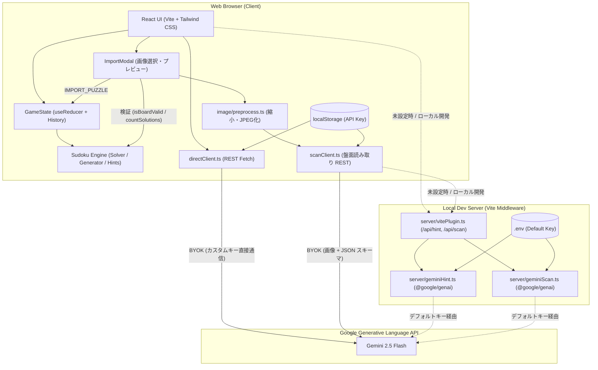
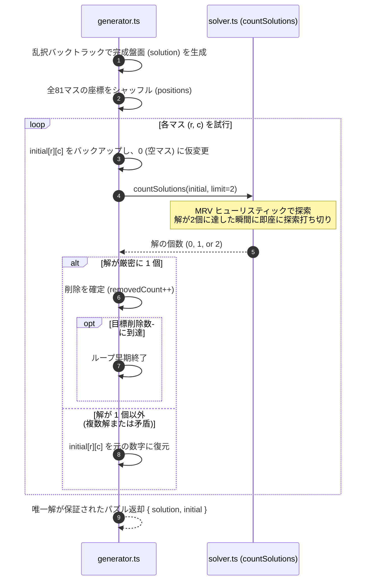
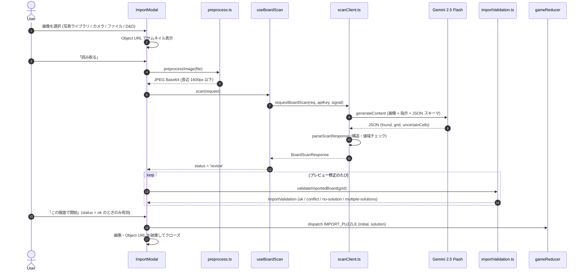
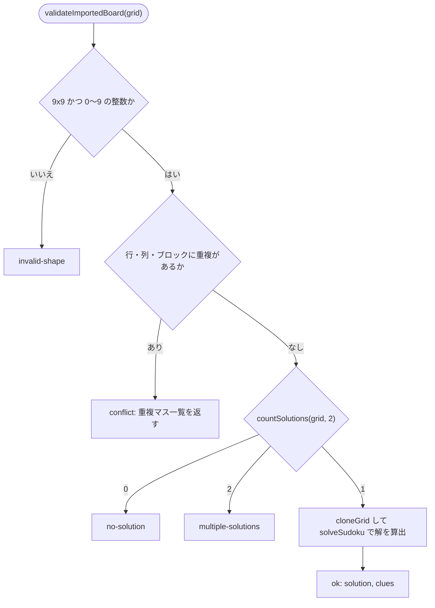
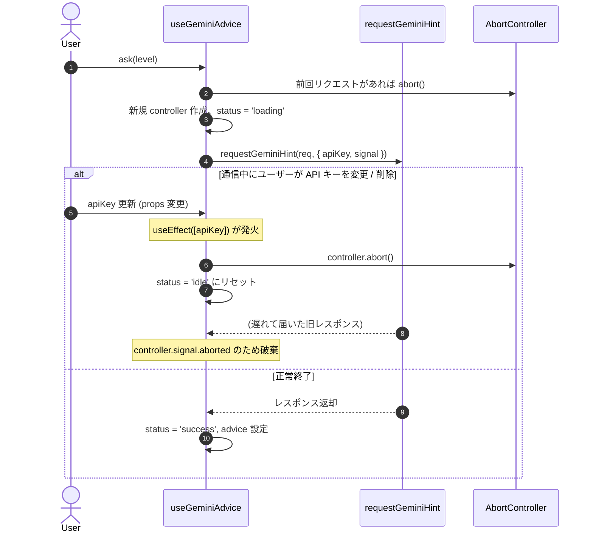
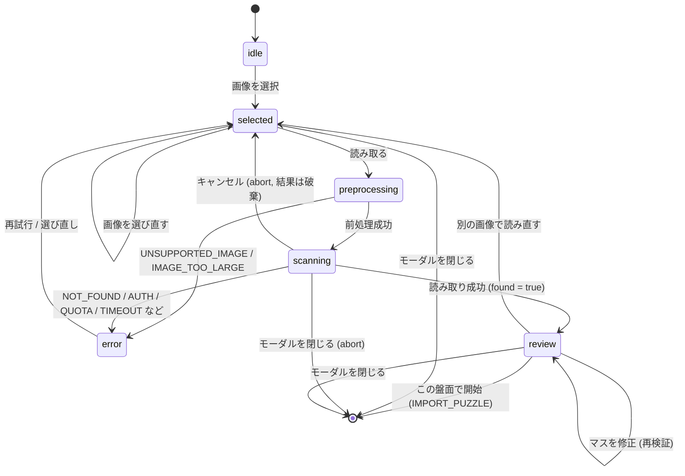

# Sudoku AI システム設計書 (System Design Specification)

## 1. システムアーキテクチャ設計

### 1.1 全体構成
本システムは、ブラウザ単体で完結する完全なフロントエンド Single Page Application (SPA) として構成され、Gemini AI との通信にはハイブリッドなデュアル通信方式を採用している。



### 1.2 通信方式設計 (デュアル・アシスタント)
1. **Direct Client 方式 (本番推奨)**:
   - ユーザーが入力した API キーを用いて、ブラウザから Google の REST エンドポイント (`https://generativelanguage.googleapis.com/v1beta/models/gemini-2.5-flash:generateContent?key=...`) へ直接リクエスト。
   - Vercel 等のサーバーレスホスティングで問題となるタイムアウト、環境変数管理、コールドスタートを完全に回避。
2. **Server Proxy 方式 (開発・フォールバック)**:
   - Vite 開発サーバーに組み込まれた `geminiHintPlugin` が `POST /api/hint` をハンドリング。
   - `@google/genai` 公式 SDK を利用し、開発時に `.env` のデフォルトキーで即座に動作検証可能。
3. **盤面画像取り込み (`scanClient.ts`)**:
   - ヒントと同じ 2 方式を採用する。キー設定時は Direct 方式で画像を `inline_data` として送信し、未設定時は開発サーバーの `POST /api/scan` を利用する。
   - 本番環境（Vercel 静的ホスティング）には `/api/scan` が存在しないため、キー未設定時は送信前に API キー設定を促す（FR-7.8）。
   - 画像はリクエストボディにのみ含め、自前サーバー・ストレージに保存しない。

---

## 2. ディレクトリ & モジュール構造

```text
sudoku-ai-app/
├── docs/                      # プロジェクト仕様書・設計書
│   ├── requirements.md        # 要件定義書
│   └── design.md              # システム設計書
├── server/                    # 開発用 Vite サーバープラグイン
│   ├── geminiHint.ts          # サーバー側 Gemini プロンプト生成・API通信
│   ├── geminiScan.ts          # [新規] サーバー側 盤面画像読み取り (/api/scan)
│   └── vitePlugin.ts          # Vite ミドルウェアハンドラ (/api/hint, /api/scan)
├── src/
│   ├── components/            # UI コンポーネント群
│   │   ├── ActionTools.tsx    # Undo, 消去, メモ切替, 誤入力リセットボタン
│   │   ├── ApiKeyModal.tsx    # API キー設定モーダル (BYOK)
│   │   ├── Board.tsx          # 9x9 数独グリッド表示
│   │   ├── Cell.tsx           # 個別セル（数字・メモ表示・ハイライト）
│   │   ├── DifficultyBar.tsx  # 難易度選択バー（+「画像から取り込み」ボタン）
│   │   ├── GeminiAdvisor.tsx  # Gemini AI アドバイザー（L1〜L4）
│   │   ├── Header.tsx         # タイマー, ミスカウンタ, 設定, テーマ
│   │   ├── HintPanel.tsx      # 論理ヒント（解法技法ポップオーバー内蔵）・全メモ・解答展開
│   │   ├── ImportModal.tsx    # [新規] 画像選択 → 読み取り → プレビュー修正 → 開始
│   │   ├── ImportPreviewGrid.tsx # [新規] 読み取り結果の編集可能プレビュー盤面
│   │   ├── Numpad.tsx         # ナンパッド（残り配置可能数バッジ付き）
│   │   └── VictoryModal.tsx   # クリア祝賀モーダル
│   ├── hooks/                 # React カスタムフック
│   │   ├── useApiKey.ts       # API キーの localStorage 同期
│   │   ├── useBoardScan.ts    # [新規] 読み取り状態管理 & Abort 管理
│   │   ├── useGeminiAdvice.ts # Gemini アドバイス要求 & Abort 管理
│   │   ├── useSudokuGame.ts   # ゲームメインループ & キーバインド
│   │   ├── useTheme.ts        # ダークモード管理
│   │   └── useTimer.ts        # ゲームタイマー計測
│   ├── lib/
│   │   ├── gemini/            # クライアント側 Gemini 通信ライブラリ
│   │   │   ├── directClient.ts# REST API 直接呼び出し & プロンプト生成
│   │   │   ├── hintClient.ts  # 通信方式の自動振り分けルーター
│   │   │   ├── scanClient.ts  # [新規] 盤面読み取りの通信ルーター (Direct / Proxy)
│   │   │   ├── scanPrompt.ts  # [新規] 読み取りプロンプト・JSON スキーマ・応答パーサ (クライアント/サーバー共用)
│   │   │   └── types.ts       # Gemini 連携関連の型定義 (+ Scan 系の型)
│   │   ├── image/
│   │   │   └── preprocess.ts  # [新規] 画像の復号・回転補正・縮小・JPEG 化
│   │   └── sudoku/            # 数独コアロジック
│   │       ├── board.ts       # 盤面コピー, 配置妥当性, ミスカウント
│   │       ├── gameReducer.ts # ゲーム状態遷移 (Reducer) (+ IMPORT_PUZZLE)
│   │       ├── generator.ts   # 唯一解保証パズル生成
│   │       ├── hints.ts       # 誤入力優先検知 & Naked/Hidden Single推論
│   │       ├── importValidation.ts # [新規] 取り込み盤面の検証 (構造・重複・解の個数)
│   │       ├── solver.ts      # MRV バックトラッキング解法 & 解数カウント
│   │       └── types.ts       # 数独ドメインの型定義
│   ├── App.tsx                # ルートコンポーネント
│   └── main.tsx               # アプリケーションエントリポイント
```

---

## 3. データ構造 & ドメインモデル設計

### 3.1 基本型定義 ([`src/lib/sudoku/types.ts`](file:///c:/Users/takeo.satou/Documents/GA/sudoku-ai-app/src/lib/sudoku/types.ts))

```ts
export type Grid = number[][]          // 9x9 の数値配列 (0: 空マス, 1〜9: 配置数字)
export type Notes = Set<number>[][]    // 9x9 の Set 配列 (候補数字の集合)
export type Difficulty = 'easy' | 'medium' | 'hard'

export interface Position {
  row: number // 0〜8
  col: number // 0〜8
}

// 共通ヒントインターフェース
export interface BaseHint {
  type: string
  badge: string
  row: number
  col: number
  reason: string
}

// 数字配置ヒント (正解数字を持つ)
export interface PlacementHint extends BaseHint {
  kind: 'placement'
  num: number // 正解の数字 (1〜9)
}

// 誤入力修正ヒント (正解数字を持たず、現在の誤入力数字を持つ)
export interface CorrectionHint extends BaseHint {
  kind: 'correction'
  currentNum: number // 現在誤って入力されている数字
}

// 判別可能 Union 型
export type Hint = PlacementHint | CorrectionHint
```

### 3.2 ゲーム状態管理モデル ([`src/lib/sudoku/gameReducer.ts`](file:///c:/Users/takeo.satou/Documents/GA/sudoku-ai-app/src/lib/sudoku/gameReducer.ts))

```ts
export type PuzzleSource = 'generated' | 'imported' // [新規] 問題の出自

export interface GameState {
  gameId: number
  difficulty: Difficulty
  source: PuzzleSource   // [新規] 'imported' の場合は難易度ではなく「取り込み問題」と表示
  solution: Grid         // 完成盤面（正解データ）
  initial: Grid          // 初期問題盤面（編集不可手がかり）
  board: Grid            // 現在の盤面
  notes: Notes           // 現在の候補メモ
  selected: Position | null // 選択中マス
  noteMode: boolean      // メモ入力モード中か
  history: Snapshot[]    // Undo 用履歴スタック（最大 30 手）
  mistakes: number       // ミス累計カウント (最大 3)
  activeHint: Hint | null// 現在ハイライト中のヒント
  hintPanel: HintPanelState // ヒントパネルの表示状態
}

export type GameAction =
  | { type: 'NEW_GAME'; difficulty: Difficulty; solution: Grid; initial: Grid }
  | { type: 'IMPORT_PUZZLE'; solution: Grid; initial: Grid } // [新規] 検証済み取り込み盤面で開始
  | { type: 'SELECT'; pos: Position }
  | { type: 'MOVE'; dRow: number; dCol: number }
  | { type: 'INPUT'; num: number }
  | { type: 'ERASE' }
  | { type: 'UNDO' }
  | { type: 'TOGGLE_NOTE_MODE' }
  | { type: 'HINT' }
  | { type: 'AUTO_NOTES' }
  | { type: 'SOLVE_ALL' }
  | { type: 'CHECK' }
```

- `IMPORT_PUZZLE` は `NEW_GAME` と同じ初期化（`gameId` 加算、履歴・ミス・メモ・ヒントのリセット）を行い、`source: 'imported'` を設定する。`difficulty` は直前の値を保持する（難易度バーの次回生成用）。
- Reducer は副作用を持たないため、解の算出（`solveSudoku`）と唯一解検証は呼び出し側（`ImportModal` → `validateImportedBoard`）で完了させてから dispatch する。
- タイマーは `gameId` の変化でリセットされる既存の仕組みをそのまま利用する。

### 3.3 盤面取り込み関連の型 ([`src/lib/gemini/types.ts`](file:///c:/Users/takeo.satou/Documents/GA/sudoku-ai-app/src/lib/gemini/types.ts), `importValidation.ts`) [新規]

```ts
// Gemini への読み取りリクエスト
export interface BoardScanRequest {
  imageBase64: string   // 前処理済み JPEG (data: プレフィックスなし)
  mimeType: 'image/jpeg'
}

// Gemini からの読み取り結果 (JSON 構造化出力をパースしたもの)
export interface BoardScanResponse {
  found: boolean                 // 画像内に数独盤面が見つかったか
  grid: number[][]               // 9x9, 0 = 空マス
  uncertainCells: Position[]     // 読み取りに自信がないマス
}

export type BoardScanErrorCode =
  | 'NO_API_KEY'        // 本番環境でキー未設定
  | 'OFFLINE'
  | 'UNSUPPORTED_IMAGE' // 復号不可 (HEIC 等)
  | 'IMAGE_TOO_LARGE'   // 前処理後 4MB 超
  | 'NOT_FOUND'         // found: false
  | 'INVALID_RESPONSE'  // JSON 不正・9x9 でない・値域外
  | 'AUTH'              // 401/403 キー不正
  | 'QUOTA'             // 429 利用上限
  | 'TIMEOUT'           // 60 秒
  | 'NETWORK'
  | 'ABORTED'           // ユーザーキャンセル (UI には表示しない)
  | 'UPSTREAM_ERROR'

// 取り込み盤面の検証結果
export type ImportValidation =
  | { status: 'ok'; solution: Grid; clues: number }
  | { status: 'invalid-shape' }
  | { status: 'conflict'; cells: Position[]; clues: number } // 重複マス
  | { status: 'no-solution'; clues: number }
  | { status: 'multiple-solutions'; clues: number }
```

---

## 4. コアアルゴリズム詳細設計

### 4.1 唯一解保証パズル生成アルゴリズム (`generator.ts` & `solver.ts`)

従来の「無条件ランダム削除」から、「厳密解検証付き段階削除」へ刷新。



#### 解カウント高速化のポイント:
- **盤面不変保証**: 探索前に `cloneGrid(board)` し、呼び出し元の盤面を一切変更しない。
- **MRV (Minimum Remaining Values)**: 空きマスを探索する際、行・列・ブロックの制約から「候補数が最も少ない空きマス」を優先的に選択して枝刈りを最大化。
- **配置矛盾事前ガード**: `isBoardValid` により、初期盤面に重複がある場合は探索を行わずに即座に `0` を返却。

### 4.2 誤入力最優先検知 & 論理ヒントアルゴリズム (`hints.ts`)

```mermaid
flowchart TD
    Start([ヒント要求]) --> CheckMistake{盤面に誤入力があるか？<br/>board[r][c] !== solution[r][c]}
    
    CheckMistake -- "はい (誤入力あり)" --> ReturnCorrection["CorrectionHint を返却<br/>- kind: 'correction'<br/>- 正解数字は非表示<br/>- 誤りマス座標と消去理由を提示<br/>- トーン: rose (警告)"]
    
    CheckMistake -- "いいえ (正常)" --> CalcCandidates[computeCellCandidates<br/>ルール上の候補数字を算出]
    
    CalcCandidates --> Strategy1{Naked Single<br/>候補が1つのマス}
    Strategy1 -- "該当あり" --> RetNaked["PlacementHint (唯一候補マス)<br/>kind: 'placement', 正解数字あり"]
    
    Strategy1 -- "なし" --> Strategy2{Hidden Single (Block)<br/>ブロック内で数字が一択}
    Strategy2 -- "該当あり" --> RetHiddenB["PlacementHint (ブロック隠れ一択)"]
    
    Strategy2 -- "なし" --> Strategy3{Hidden Single (Row / Col)<br/>行または列内で数字が一択}
    Strategy3 -- "該当あり" --> RetHiddenRC["PlacementHint (行/列の隠れ一択)"]
    
    Strategy3 -- "なし" --> Fallback["PlacementHint (高難度推論)<br/>解から1手を抽出"]
```

### 4.3 Gemini AI プロンプト構造 & ヒントレベル整合設計

プロンプト構築関数 `buildPrompt` は、クライアント直接通信（`directClient.ts`）とサーバープラグイン（`geminiHint.ts`）で完全に同一のロジックを共有する。

```text
# プロンプト構成
1. システム指示 (SYSTEM_INSTRUCTION)
   - 親切な数独コーチ、温かく簡潔な日本語トーン (最大4文程度)
   - 確定情報の厳守、指定レベルを超えた回答漏洩の禁止
   - 盤面ミスがある場合は最優先で指摘
2. 現在の盤面 (81マスのテキスト表現)
3. 状況 (空きマス数、ユーザーのミス回数、誤入力マス一覧、メモ一覧)
4. 指導対象 (確定情報)
   - 誤入力あり: 【誤入力の見直し】行X、列Yの入力「W」は誤り。正解は「N」。※架空の推論は捏造せず案内。
   - 正常時: 行X、列Yに「N」（手法名、論理根拠メモ）
5. レベル別指示
```

| ヒントレベル | 通常時の指示 (LEVEL_INSTRUCTIONS_NORMAL) | 誤入力時の指示 (LEVEL_INSTRUCTIONS_MISTAKE) |
|---|---|---|
| **レベル1 (ノーヒント)** | 具体的なマスも数字も言わない。着眼点の方向のみ促す。 | 具体的なマスや数字は言わない。誤入力の存在と見直しのみ促す。 |
| **レベル2 (着眼点)** | 注目すべき範囲（ブロック/行/列）と解法パターンを伝える。 | 誤入力が存在する大まかな範囲（ブロック/行/列）のみを伝える。 |
| **レベル3 (マス特定)** | 具体的なマス（行・列）と根拠を説明。数字は伏せる。 | 誤入力が存在する具体的なマス（行・列）を特定し、見直しを促す。 |
| **レベル4 (直接回答)** | 注目マスと正解数字を明示し、論理ステップを解説。 | 誤入力マスと保存済みの正解を提示（架空の論理解説は作らない）。 |

### 4.4 盤面画像取り込みパイプライン [新規]

#### 4.4.1 全体シーケンス



#### 4.4.2 画像前処理 (`preprocess.ts`)

| 手順 | 処理 | 備考 |
|---|---|---|
| 1. 復号 | `createImageBitmap(file, { imageOrientation: 'from-image' })` | EXIF 回転を反映。失敗時は `UNSUPPORTED_IMAGE`。 |
| 2. 縮小 | 長辺が 1600px を超える場合のみ等比縮小 | 小さい画像は拡大しない。 |
| 3. 描画 | `OffscreenCanvas`（非対応環境は `<canvas>`）に描画 | 背景を白で塗ってから描画し、透過 PNG を JPEG 化した際の黒背景化を防ぐ。 |
| 4. エンコード | JPEG・品質 0.85 で Blob 化し Base64 へ変換 | 4MB 超は `IMAGE_TOO_LARGE`。 |
| 5. 解放 | `ImageBitmap.close()` | メモリリーク防止。 |

- iPhone の写真ライブラリから HEIC を選択した場合、Safari は通常 JPEG に変換して渡すため追加対応は不要。PC 版ブラウザで復号できない場合のみエラーとする。

#### 4.4.3 プロンプトと JSON スキーマ (`scanPrompt.ts`)

クライアント（`scanClient.ts`）とサーバー（`geminiScan.ts`）は同一の `SCAN_PROMPT` / `SCAN_RESPONSE_SCHEMA` / `parseScanResponse` を共有する（ヒント機能の `buildPrompt` 共有と同じ方針）。

```text
# 指示 (SCAN_PROMPT の要旨)
- 画像内の 9x9 数独盤面を読み取り、行ごとに 9 個の整数で返す。空マスは 0。
- 印刷された数字（問題の初期数字）のみを読み取る。手書きの数字・メモ・丸印は無視して 0 とする。
- 盤面が複数ある場合は最も大きく写っている 1 つを対象とする。
- 数独盤面が見つからない場合は found=false とし、grid は全て 0 とする。
- 判読が難しいマスは最も可能性の高い数字を入れ、その座標を uncertainCells に含める（row, col は 0 始まり）。
- 推測で数字を補完しない。解いた結果を書き込まない。
```

```jsonc
// generationConfig
{
  "responseMimeType": "application/json",
  "responseJsonSchema": {
    "type": "object",
    "properties": {
      "found": { "type": "boolean" },
      "grid": {
        "type": "array", "minItems": 9, "maxItems": 9,
        "items": {
          "type": "array", "minItems": 9, "maxItems": 9,
          "items": { "type": "integer", "minimum": 0, "maximum": 9 }
        }
      },
      "uncertainCells": {
        "type": "array",
        "items": {
          "type": "object",
          "properties": {
            "row": { "type": "integer", "minimum": 0, "maximum": 8 },
            "col": { "type": "integer", "minimum": 0, "maximum": 8 }
          },
          "required": ["row", "col"]
        }
      }
    },
    "required": ["found", "grid", "uncertainCells"]
  },
  "temperature": 0
}
```

- REST の画像パートは `{ "inline_data": { "mime_type": "image/jpeg", "data": "<Base64>" } }` とし、テキスト指示パートと同じ `contents[0].parts` に含める。
- スキーマ指定の有無にかかわらず、`parseScanResponse` で **9x9・整数・0〜9・座標範囲** を必ず再検証する（スキーマを満たさない応答は `INVALID_RESPONSE`）。
- 構造化出力のパラメータ名（`responseJsonSchema` / `responseSchema`）は実装時に公式ドキュメントで最終確認する。

#### 4.4.4 取り込み盤面の検証 (`importValidation.ts`)



- 重複マスの特定は `isBoardValid` の真偽だけでは足りないため、行・列・ブロック単位で重複している座標を収集する補助関数を追加する。
- `countSolutions` は入力を変更しない既存実装を利用し、`solveSudoku` には複製を渡す。
- 手がかり数 `clues` は全ステータスで返し、17 未満の場合は UI で補足を表示する（ゲーム開始可否の判定には使わない）。

#### 4.4.5 エラー表示方針

| コード | 表示メッセージ（要旨） | ユーザーの次の操作 |
|---|---|---|
| `NO_API_KEY` | 画像の読み取りには Gemini API キーの設定が必要です。 | 「API キーを設定」ボタンで設定モーダルへ |
| `OFFLINE` | 画像の読み取りにはインターネット接続が必要です。 | 接続後に再試行 |
| `UNSUPPORTED_IMAGE` | この画像形式は読み込めません。JPEG または PNG を選択してください。 | 画像を選び直す |
| `IMAGE_TOO_LARGE` | 画像サイズが大きすぎます。 | 画像を選び直す |
| `NOT_FOUND` | 画像から数独の盤面が見つかりませんでした。盤面全体が写るように撮影してください。 | 画像を選び直す |
| `INVALID_RESPONSE` | 読み取り結果を解釈できませんでした。 | 再試行 |
| `AUTH` | API キーが無効です。 | API キー設定へ |
| `QUOTA` | 利用上限に達しました。しばらく待ってから再試行してください。 | 時間をおいて再試行 |
| `TIMEOUT` / `NETWORK` / `UPSTREAM_ERROR` | 通信に失敗しました。 | 再試行 |
| `ABORTED` | （表示しない） | — |

---

## 5. 状態管理 & ライフサイクル設計

### 5.1 `useGeminiAdvice` フックのライフサイクル制御



### 5.2 `useBoardScan` フックの状態遷移 [新規]

`useGeminiAdvice` と同じく `AbortController` で通信を管理し、`useCallback` の依存配列に `apiKey` を含める（Ref 併用はしない）。



- モーダルを閉じる、`apiKey` が変わる、またはアンマウントされた時点で通信中のリクエストを `abort()` し、Object URL を `URL.revokeObjectURL` で解放する。
- `abort` 済みリクエストの応答・エラーは状態に反映しない（`signal.aborted` を確認して破棄）。
- 本番判定は `import.meta.env.DEV` を用いる。`DEV === false` かつキー未設定の場合は、通信せずに `NO_API_KEY` とする。

### 5.3 取り込みモーダルの画面構成 [新規]

| ステップ | 表示内容 | 主な操作 |
|---|---|---|
| ① 画像選択 | ドロップ領域、「写真を選ぶ / 撮影する」ボタン、プライバシー注記（画像は Gemini API に送信される） | 画像選択、閉じる |
| ② 確認 | 画像サムネイル | 「読み取る」、選び直す |
| ③ 読み取り中 | スピナー、「盤面を読み取っています…」 | キャンセル |
| ④ プレビュー | 編集可能な 9x9 盤面（自信なしマス：amber 枠、重複マス：rose 背景）、手がかり数、検証結果メッセージ | マスをタップ → 0〜9 選択、「この盤面で開始」、別の画像で読み直す |

- プレビュー盤面の数字入力は、モーダル内に専用の小型ナンパッド（1〜9 + 消去）を表示して行う。ゲーム本体のキーボードショートカットはモーダル表示中は無効化する。
- 進行中のゲームがある場合（`board` が `initial` と異なる）は、「この盤面で開始」押下時に確認ダイアログを表示する。モーダルを途中で閉じた場合、現在のゲームとタイマーには影響を与えない。
- モバイル（縦画面）では全画面シート、デスクトップでは中央ダイアログとして表示する。

---

## 6. テスト設計

### 6.1 テスト方針
Vitest による高速・高カバレッジな自動テストを構築。DOM 非依存で実行可能な設計とし、CI/CD やローカル環境で即座に検証可能とする。

### 6.2 主なテストスイート
1. **`sudoku.test.ts` (数独コア & アルゴリズム)**:
   - `isValidPlacement`, `isSolved`, `countMistakes`, `countRemaining`, `cleanPeerNotes` の正確性
   - `countSolutions` の盤面不変保証、解0件（矛盾・重複）、解1件（一意）、解2件（複数解上限）の正確性
   - 再現可能シード（Mulberry32 PRNG）を用いた **各難易度 100問連続生成バッチテスト**（複数解発生率 0/100 の検証、生成時間の統計計測）
   - `findSmartAIHint` の誤入力優先検知（`CorrectionHint` と `PlacementHint` の分離、全マス埋まり誤入力、修正後の復帰）
2. **`useGeminiAdvice.test.ts` (フック状態・非同期・Abort 制御)**:
   - 再読み込みなしでの `apiKey` の動的反映
   - 通信中にキーを変更・削除した際のリクエスト即時中断、`idle` 復帰、遅延結果の非表示
3. **`prompt.test.ts` (プロンプト生成 & 通信経路整合)**:
   - Direct クライアントと Server プラグインにおける正常時および誤入力時のプロンプト出力
   - ヒントレベル 1〜4 各段階での指示文の完全一致
4. **`importValidation.test.ts` (取り込み盤面の検証)** [新規]:
   - 9x9 でない・値域外・非整数の盤面が `invalid-shape` になること
   - 重複のある盤面が `conflict` となり、重複マスの座標が過不足なく返ること
   - 既知の唯一解盤面が `ok` となり、返却された `solution` が完成盤面かつ手がかりと一致すること
   - 解が0個・複数の既知盤面がそれぞれ `no-solution` / `multiple-solutions` になること
   - 入力盤面を変更しないこと、1 回の検証が 50 ms 以内であること
5. **`scanPrompt.test.ts` (応答パーサ & 通信経路整合)** [新規]:
   - 正常 JSON、`found: false`、9 行未満・10 列・文字列混入・範囲外座標を含む応答の判定
   - クライアントとサーバーが同一のプロンプト・スキーマを使用していること
   - REST リクエストボディに `inline_data`（`image/jpeg`）と `responseMimeType: application/json` が含まれること
6. **`useBoardScan.test.ts` (フック状態・Abort 制御)** [新規]:
   - 通信をモックし、実際に渡された API キーと画像データを確認
   - キャンセル・モーダルクローズ・キー変更時の即時中断と、遅延応答の非表示
   - 本番モードでキー未設定時に通信せず `NO_API_KEY` となること
   - HTTP 401/403/429・タイムアウト時のエラーコード変換
7. **`gameReducer` の `IMPORT_PUZZLE`** [新規]（`sudoku.test.ts` に追加）:
   - `source: 'imported'`、初期盤面のロック、履歴・ミス・メモ・ヒントのリセット、`gameId` の加算
   - 取り込み後に誤入力リセット・論理ヒント・クリア判定が通常どおり動作すること

### 6.3 手動確認項目（画像取り込み）[新規]
- iPhone（Safari / ホーム画面 PWA）で、写真ライブラリからの選択とカメラ撮影の両方で取り込めること。
- 新聞・雑誌の撮影画像、Web 上の数独のスクリーンショット、斜めに撮影した画像、手書きの書き込みがある画像での読み取り結果。
- ダークモードでのプレビュー盤面の視認性（自信なしマス・重複マスの色分け）。
- 取り込み後のプレイ、Gemini コーチ、勝利モーダルの「取り込み問題」表示。
- 最終確認として `npm test`、`npm run build` に加え、Vercel のプレビュー環境で動作確認を行う。
